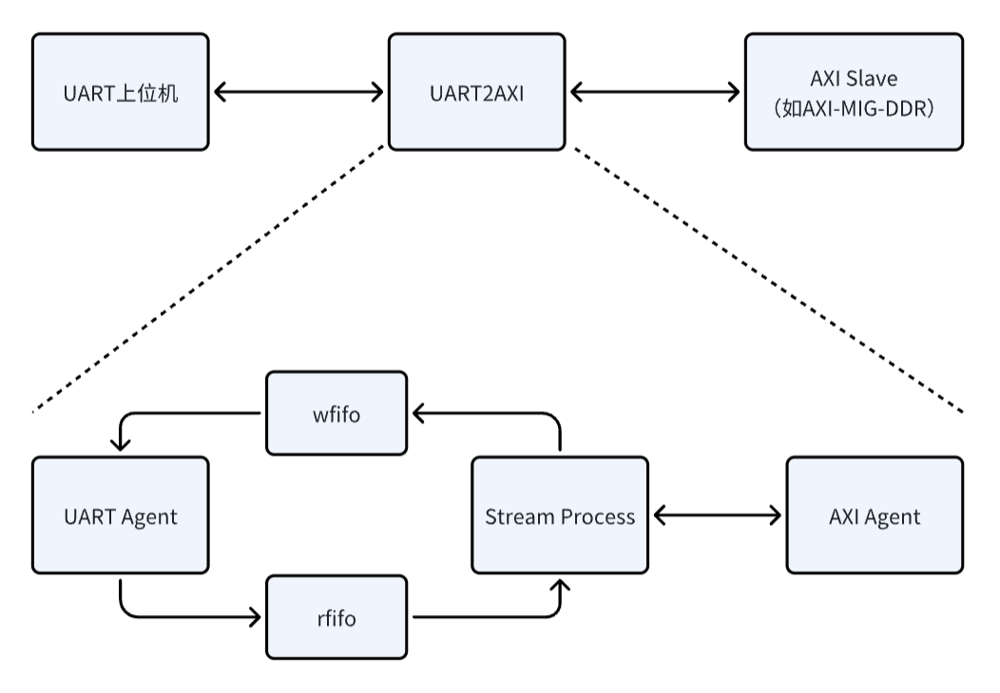

# UART2AXI: A Small and Beautiful AXI Debugging Tool

UART2AXI is a lightweight debugging tool that bridges UART and AXI communication. It efficiently converts UART signals to AXI protocol, enabling easy integration with various FPGA platforms. This tool allows developers to test and verify AXI-based designs through simple read/write operations, making hardware debugging more accessible and efficient. Implemented in Verilog without vendor-specific IPs, it supports all FPGA platforms with sufficient resources.

UART2AXI是一款轻量级调试工具，可桥接UART和AXI通信。它能够高效地将UART信号转换为AXI协议，从而轻松与各种FPGA平台集成。该工具允许开发人员通过简单的读写操作来测试和验证基于AXI的设计，从而更轻松地进行硬件调试。它使用Verilog实现，无需特定供应商的IP，支持所有资源充足的FPGA平台。

<a href="assets/flow.png"></a>

## Getting Started

### Requirements

- 任何FPGA软硬件平台（已提供verilog明码，不含任何vendor-specific ip，支持所有FPGA平台，需资源足够）
- UART上位机软件，如Windows平台的[XCOM_V2.2.exe](assets/XCOM_V2.2.exe)（注意必须将收发模式设为16进制表示）

### Synthesis

将全部[verilog_code](verilog_code)拷贝至工程目录

实例化`uart2axi_wrapper.v`：

```verilog
    uart2axi_wrapper #(.CLK(100_000_000), .BAUDRATE(115200)) uart2axi_wrapper_inst (
        .clk(axi_clk), # 100MHz
        .rst_n(rst_n),
        .uart_rx(uart_rx),
        .uart_tx(uart_tx),
        .m_axi_gmem_AWVALID(axi_mosi_awvalid_0),
        .m_axi_gmem_AWREADY(axi_miso_awready_0),
        .m_axi_gmem_AWADDR(axi_mosi_awaddr_0_x4),
        .m_axi_gmem_AWID(axi_mosi_awid_0[0]),
        .m_axi_gmem_AWLEN(axi_mosi_awlen_0),
        .m_axi_gmem_AWSIZE(axi_mosi_awsize_0),
        .m_axi_gmem_AWBURST(axi_mosi_awburst_0),
        .m_axi_gmem_AWLOCK(),
        .m_axi_gmem_AWCACHE(),
        .m_axi_gmem_AWPROT(),
        .m_axi_gmem_AWQOS(),
        .m_axi_gmem_AWREGION(),
        .m_axi_gmem_AWUSER(),
        .m_axi_gmem_WVALID(axi_mosi_wvalid_0),
        .m_axi_gmem_WREADY(axi_miso_wready_0),
        .m_axi_gmem_WDATA(axi_mosi_wdata_0),
        .m_axi_gmem_WSTRB(),
        .m_axi_gmem_WLAST(axi_mosi_wlast_0),
        .m_axi_gmem_WID(),
        .m_axi_gmem_WUSER(),
        .m_axi_gmem_ARVALID(axi_mosi_arvalid_0),
        .m_axi_gmem_ARREADY(axi_miso_arready_0),
        .m_axi_gmem_ARADDR(axi_mosi_araddr_0_x4),
        .m_axi_gmem_ARID(axi_mosi_arid_0[0]),
        .m_axi_gmem_ARLEN(axi_mosi_arlen_0),
        .m_axi_gmem_ARSIZE(axi_mosi_arsize_0),
        .m_axi_gmem_ARBURST(axi_mosi_arburst_0),
        .m_axi_gmem_ARLOCK(),
        .m_axi_gmem_ARCACHE(),
        .m_axi_gmem_ARPROT(),
        .m_axi_gmem_ARQOS(),
        .m_axi_gmem_ARREGION(),
        .m_axi_gmem_ARUSER(),
        .m_axi_gmem_RVALID(axi_miso_rvalid_0),
        .m_axi_gmem_RREADY(axi_mosi_rready_0),
        .m_axi_gmem_RDATA(axi_miso_rdata_0),
        .m_axi_gmem_RLAST(axi_miso_rlast_0),
        .m_axi_gmem_RID(axi_miso_rid_0[0]),
        .m_axi_gmem_RUSER(),
        .m_axi_gmem_RRESP(axi_miso_rresp_0),
        .m_axi_gmem_BVALID(axi_miso_bvalid_0),
        .m_axi_gmem_BREADY(axi_mosi_bready_0),
        .m_axi_gmem_BRESP(axi_miso_bresp_0),
        .m_axi_gmem_BID(axi_miso_bid_0[0]),
        .m_axi_gmem_BUSER()
    );
```

AXI从模块可以是AXI-MIG-DDR或其他AXI4从模块

### UART Read AXI

- 格式（16进制）

```
00 [ARADDR:4Byte] [ARLEN:1Byte]
```

- Example

UART上位机发送```00 00 00 00 AA 07```

第一个`00`是读标志位

其次`00 00 00 AA`表示读首地址`0x000000AA`，并递增

紧接着`07`表示读突发长度为8（00表示长度1，FF表示长度256）

发送完毕，UART上位机将接收到FPGA返回的读数据

### UART Write AXI

- 格式（16进制）

```
01 [AWADDR:4Byte] [AWLEN:1Byte] [WDATA]
```

- Example

UART上位机发送```01 00 00 00 AB 07 00 00 00 00 11 11 11 11 22 22 22 22 33 33 33 33 44 44 44 44 55 55 55 55 66 66 66 66 77 77 77 77```

第一个`01`是写标志位

其次`00 00 00 AB`表示写首地址`0x000000AB`，并递增

紧接着`07`表示写突发长度为8

最后的```00 00 00 00 11 11 11 11 22 22 22 22 33 33 33 33 44 44 44 44 55 55 55 55 66 66 66 66 77 77 77 77```表示写数据```0x00000000 0x11111111 0x22222222 0x33333333 0x44444444 0x55555555 0x66666666 0x77777777```

发送完毕，UART上位机将接收到FPGA返回的写数据（与[WDATA]一致）

### Practical Video

[视频](assets/test.mp4)

### 其他说明

- 部分源码采用Vitis HLS 2022.2编译，见[hls_src](hls_src)
